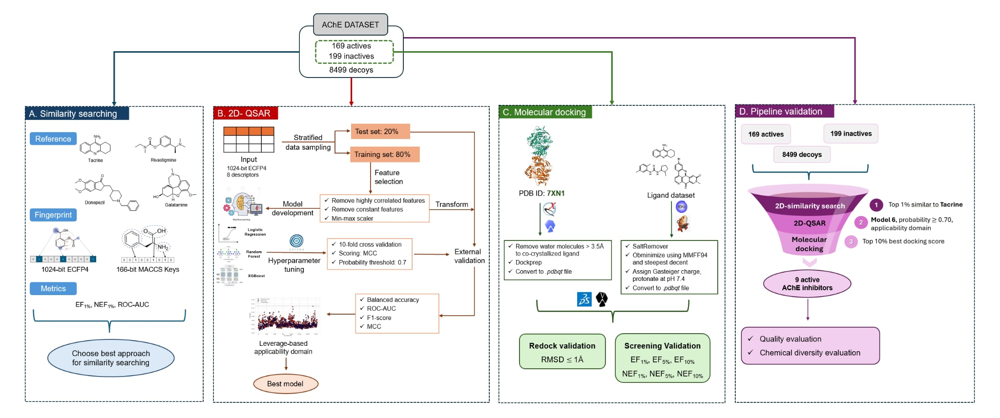

# AChE-Project
This project perform virtual screening on data sets of AChE inhibitors using similarity searching, 2D-QSAR, and molecular docking

by Cao-Minh Truong* and Denner E. dos Santos Silveira*

*Correspondence: cao-minh.truong@etu.u-paris.fr , denner.evaristo-dos-santos-silveira@etu.u-paris.fr

